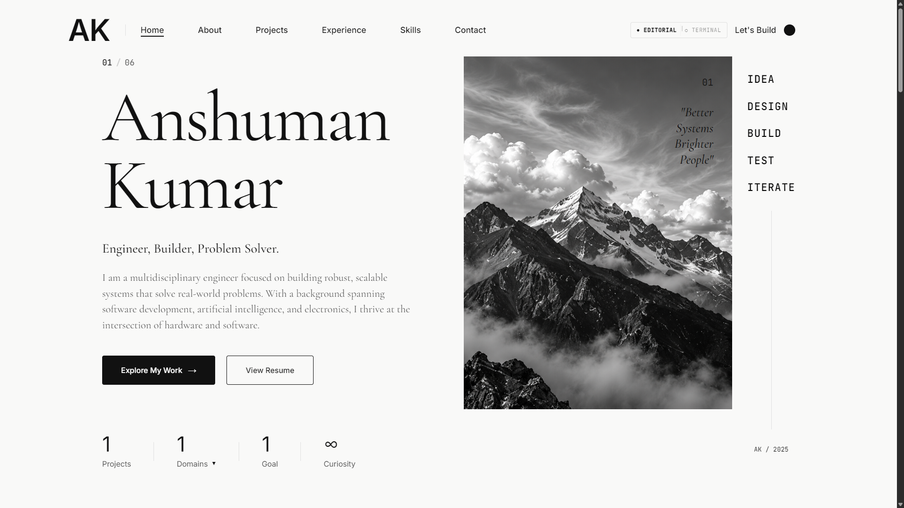
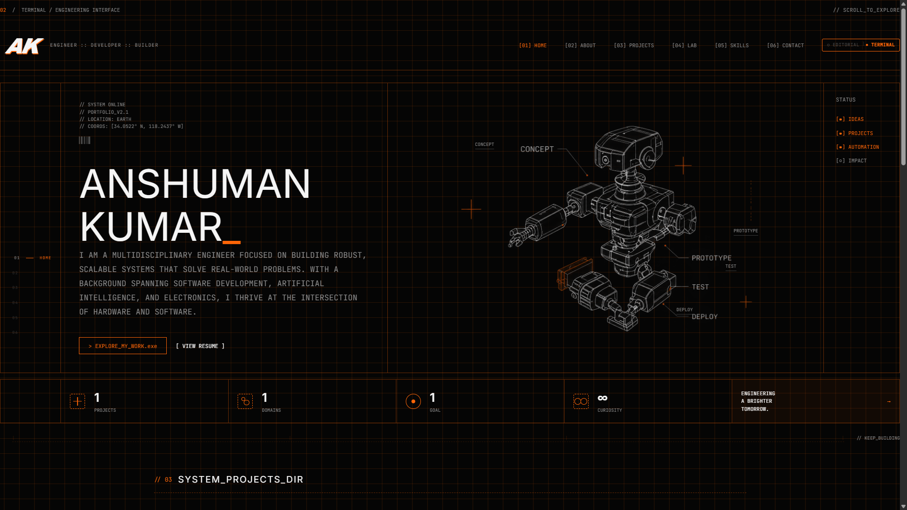
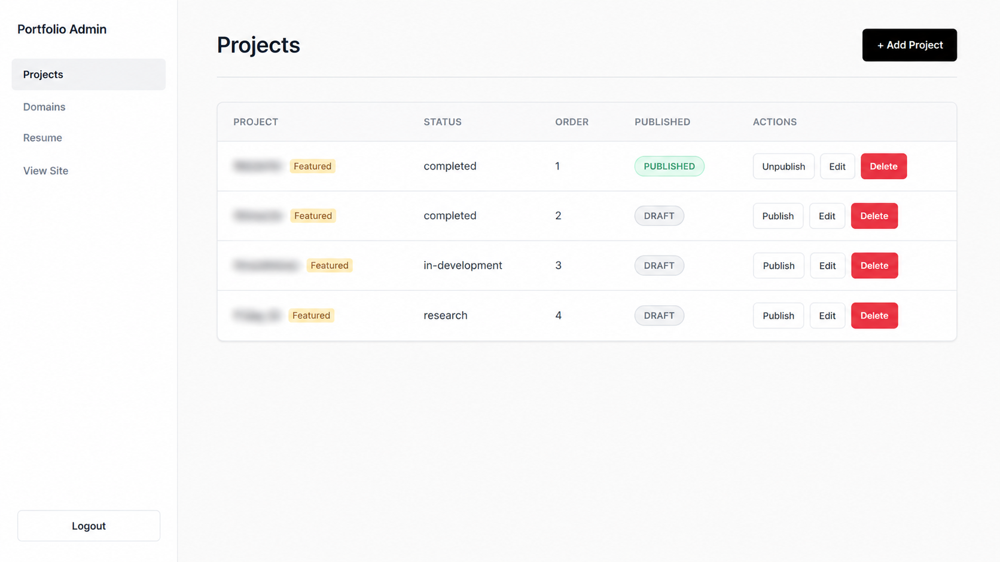

<div align="center">

# 🚀 Open Dev Portfolio

*A premium, high-performance, and beautifully designed developer portfolio built for modern engineers.*

[](https://reactjs.org/)
[](https://vitejs.dev/)
[](https://supabase.com/)
[](https://opensource.org/licenses/MIT)

</div>

<br />

> **Stop hardcoding your portfolio.** Open Dev Portfolio provides a fully functional backend and a secure Admin Dashboard so you can update your projects, skills, and resume dynamically in real-time—without ever touching the code again.

---

## ✨ Features

- 🎨 **Premium Aesthetic**: Editorial-style typography, smooth micro-animations, and a highly polished UI.
- 🌓 **Dual Themes**: Includes both a minimal "Editorial" theme and a hacker-style "Terminal" theme.
- 📱 **Fully Responsive**: Looks perfect on desktops, tablets, and mobile devices.
- ⚡ **Lightning Fast**: Built with Vite and React for instant load times and optimized production builds.
- 🗄️ **Supabase Backend**: Complete PostgreSQL database, Auth, and Storage integration out of the box.
- 🔒 **Secure Admin Dashboard**: A protected `/admin` route to seamlessly add, edit, and publish your content.
- 🖼️ **Image Hosting**: Direct, seamless image uploads to Supabase Storage right from your dashboard.

---

## 🎯 Who is this for?

- 🎓 **Engineering & CS Students:** Stand out to recruiters with a professional, database-driven portfolio instead of a basic static site.
- 💻 **Software Engineers & Developers:** Showcase your full-stack capabilities with a dynamic template that proves you know React, databases, and auth.
- 🚀 **Freelancers & Tech Enthusiasts:** Manage your projects effortlessly through an admin dashboard.

---

## 📸 Screenshots

<details>
<summary><b>View Screenshots (Click to expand)</b></summary>

### 🖋️ Editorial Theme


### 💻 Terminal Theme


### ⚙️ Admin Dashboard


</details>

---

## 🛠️ Complete Setup Guide

Follow these steps carefully to get your full-stack portfolio up and running in minutes.

### 1️⃣ Install Dependencies
Clone the repository and install the required npm packages:
```bash
npm install
```

### 2️⃣ Set up Supabase (Your Backend & Database)
This portfolio requires a free [Supabase](https://supabase.com) project to store your data and images.

1. Go to [supabase.com](https://supabase.com) and create a new project.
2. **Create Storage Buckets (CRITICAL):**
   - In your Supabase dashboard, go to **Storage** on the left menu.
   - Click **New Bucket**.
   - Name it exactly: `project-images`
   - **Important:** Toggle the **"Public bucket"** switch to **ON**.
   - Click Save.
   - Repeat the exact same process to create a second bucket named: `portfolio-images` (also make it Public).
3. **Setup Database Tables & Security:**
   - Go to the **SQL Editor** in your Supabase dashboard.
   - Open the `database.sql` file located in your project's root folder and copy all of its contents.
   - Paste the code into the Supabase SQL Editor and click **Run**.
   - *Note: This script automatically sets up all your tables, Row Level Security (RLS) policies, and a trigger that automatically makes the first person who signs up an Admin!*

### 3️⃣ Configure Environment Variables
Connect your local code to your new Supabase backend:
1. Copy the `.env.example` file and rename it to `.env.local`:
```bash
cp .env.example .env.local
```
2. Open `.env.local` and add your Supabase project keys. You can find these in your Supabase dashboard under **Project Settings (gear icon) > API**.
   - `VITE_SUPABASE_URL`: Your Project URL
   - `VITE_SUPABASE_ANON_KEY`: Your Project `anon` / `public` key

### 4️⃣ Set Your Navbar Logo (Offline Config)
To change the "AK" initials in the top-left of the navbar to your own:
- **Windows:** Double-click the `set_logo.bat` file in your project folder. It will ask you for your initials and automatically apply them.
- **Mac/Linux:** You can manually edit the text inside `src/config/logo.json`.

### 5️⃣ Run the Application & Create Your Admin Account
Start the development server:
```bash
npm run dev
```
1. Go to `http://localhost:5173/admin/login` in your browser.
2. You will see the login screen. Since this is your first time, you need to create an account.
3. Go back to your Supabase Dashboard -> **Authentication** -> **Users** -> **Add User** -> **Create New User**.
4. Enter your email and a secure password.
5. *(Thanks to the SQL script you ran earlier, this new user is automatically granted Admin privileges).*
6. Go back to `http://localhost:5173/admin/login` and log in with those credentials!

### 6️⃣ Customize Your Portfolio
Once logged into the Admin Dashboard, navigate to:
- **Profile:** Fill out your Name, Bio, Social Links, Skills, and Experience.
- **Resume:** Paste your markdown resume and upload your profile photo.
- **Projects:** Add all your cool projects, upload cover images, and set them to "Published".

Your live portfolio will instantly update at `http://localhost:5173/`!

---

## 📜 License
This project is open-source and available under the **MIT License**.

---

<div align="center">
  <i>If you found this template helpful, don't forget to ⭐ star the repository!</i>
</div>

<br />

#### Tags
`#Portfolio` `#React` `#Supabase` `#Vite` `#EngineeringStudent` `#SoftwareEngineer` `#FullStack` `#WebDevelopment` `#OpenSource` `#DeveloperPortfolio` `#AdminDashboard`
